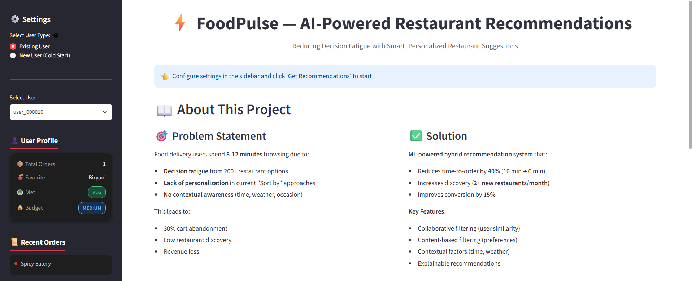
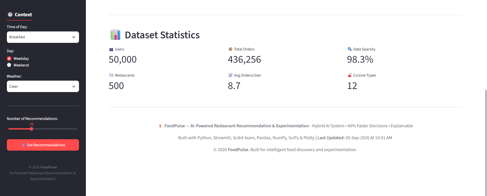
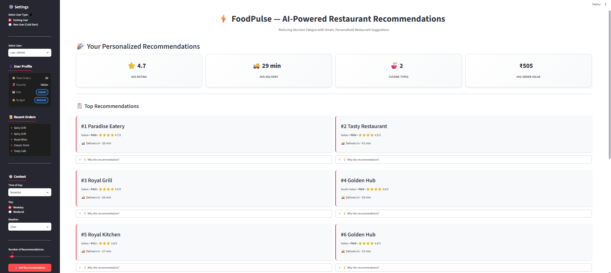
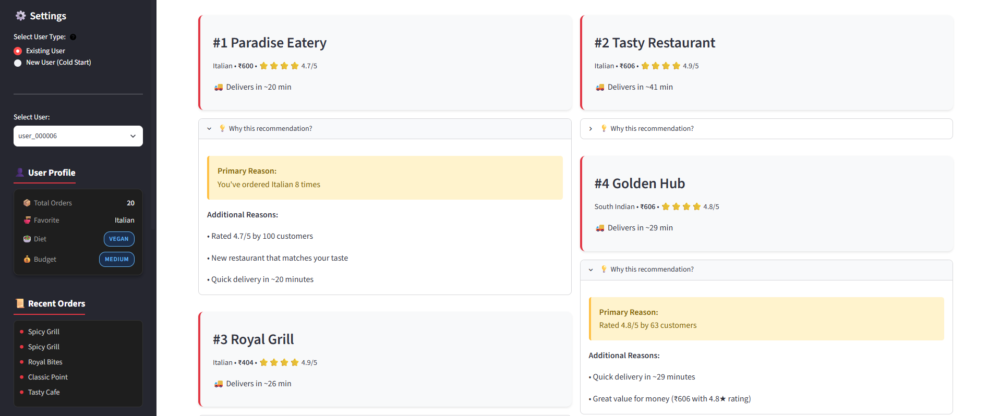
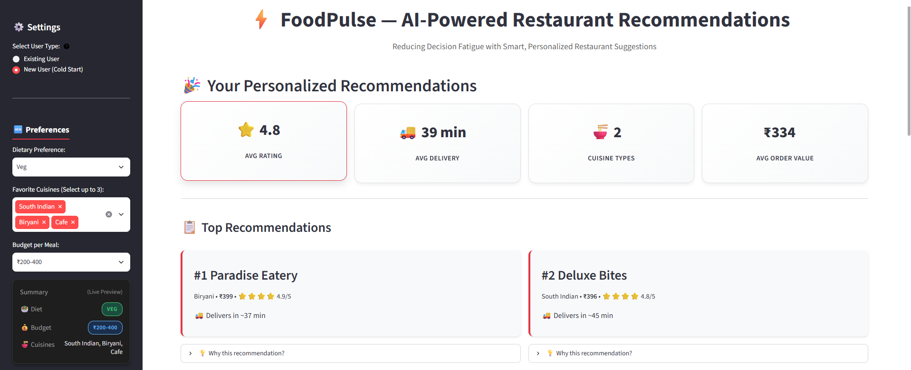
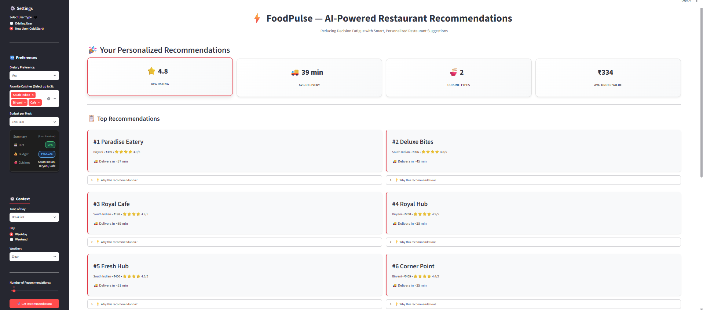
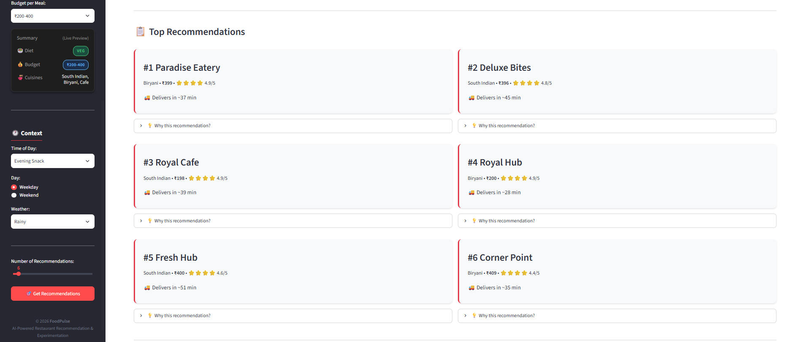

# ⚡ FoodPulse
## AI-Powered Restaurant Recommendation & Experimentation

<p align="center">
  <strong>Personalized Restaurant Recommendations × Product Analytics × A/B Testing</strong>
</p>

<p align="center">

[](https://www.python.org/)
[](https://streamlit.io/)
[](https://scikit-learn.org/)
[](https://scipy.org/)
[](LICENSE)
[]()

</p>

---

## 🚀 Live Demo

### 🌐 Try FoodPulse

**Live Application:**  
https://foodpulse-restaurant-recommendation-and-experimentation.streamlit.app/

**GitHub Repository:**  
https://github.com/KondetiAravind/FoodPulse

**LinkedIn:**  
https://www.linkedin.com/in/aravind-kondeti/

---

# 📸 Application Demo

## Existing User — Personalized Dashboard





---

## Personalized Recommendations



---

## Explainable Recommendations



---

## New User Onboarding



---

## Cold-Start Recommendations



---

## Contextual Recommendations



---

# 📌 Project Overview

Choosing a restaurant on a food-delivery platform can involve evaluating a large number of restaurants, cuisines, prices, ratings, distances, and personal preferences.

This creates a common product problem:

> **Decision fatigue during restaurant discovery.**

FoodPulse addresses this problem through a hybrid recommendation system that combines:

- Collaborative Filtering
- Content-Based Filtering
- Contextual Personalization
- Hybrid Ranking
- Cold-Start Recommendation
- Recommendation Explainability
- Product Metrics
- A/B Experimentation

The objective is not only to recommend restaurants, but to build a framework for understanding whether better recommendations actually improve the overall product experience.

---

# 🎯 Product Objective

FoodPulse is designed around the following product hypothesis:

> **Personalized restaurant recommendations can reduce the time users spend deciding what to order while improving restaurant discovery and conversion.**

## Primary Product Metric

### ⏱️ Time to Order

The primary success metric is:

**Time to Order**

The product target is to reduce decision time by approximately **40%**.

The project frames this as a reduction in the time between entering the restaurant discovery experience and placing an order.

---

## Secondary Metrics

FoodPulse also considers:

- Conversion Rate
- Restaurant Discovery Frequency
- Recommendation Engagement
- User Satisfaction

---

## Guardrail Metrics

Recommendation improvements should not negatively affect the broader customer experience.

Therefore, FoodPulse considers:

- Delivery Experience
- Cancellation Rate
- Negative User Feedback

---

# 🧠 Recommendation Architecture

FoodPulse follows a hybrid recommendation architecture.

```text
                         User
                           │
             ┌─────────────┼─────────────┐
             │             │             │
             ▼             ▼             ▼
       Order History   Preferences    Context
             │             │             │
             ▼             ▼             ▼
      Collaborative   Content-Based  Contextual
       Filtering       Filtering      Scoring
             │             │             │
             └─────────────┼─────────────┘
                           ▼
                    Hybrid Ranker
                           │
                           ▼
                Filtering & Ranking
                           │
                           ▼
                   Explainability
                           │
                           ▼
                      FoodPulse UI
````

---

# 🔀 Hybrid Recommendation System

FoodPulse combines multiple recommendation signals rather than relying on a single algorithm.

## Recommendation Weights

```text
Collaborative Filtering      40%
Content-Based Filtering      35%
Contextual Signals           25%
────────────────────────────────
Hybrid Recommendation       100%
```

### Collaborative Filtering — 40%

Learns restaurant preferences from users with similar historical ordering behavior.

The implementation uses:

* User-restaurant interaction matrix
* Cosine similarity
* Similar-user retrieval
* Weighted restaurant scoring

---

### Content-Based Filtering — 35%

Recommends restaurants based on restaurant and user attributes.

Relevant signals include:

* Cuisine
* Price
* Rating
* Delivery characteristics
* User preferences
* Most-ordered cuisine

---

### Contextual Scoring — 25%

Adds context to the recommendation process.

Relevant contextual signals include:

* Meal time
* Location
* Distance
* User preferences
* Restaurant characteristics

---

# 🧮 Hybrid Ranking

For users with sufficient historical interaction data, FoodPulse combines the recommendation components using:

```text
Final Score =
    0.40 × Collaborative Score
  + 0.35 × Content Score
  + 0.25 × Contextual Score
```

The resulting restaurants are then filtered and ranked before being presented to the user.

---

# 🧊 Cold-Start Recommendation

One of the major challenges in recommendation systems is the **cold-start problem**.

A new user may not have enough historical interactions for collaborative filtering to work effectively.

FoodPulse therefore provides a dedicated onboarding flow.

## New User Inputs

The user can provide:

* Dietary Preference
* Cuisine Preference
* Budget

The system then uses:

* Cuisine preference
* Dietary preference
* Price sensitivity
* Restaurant popularity
* Restaurant rating
* User preference similarity

to generate recommendations.

This allows FoodPulse to provide useful recommendations even when historical interaction data is unavailable.

---

# 👤 User Flows

FoodPulse supports two primary recommendation scenarios.

## Existing User

Users with historical interactions receive personalized recommendations using:

* Historical orders
* Similar users
* Restaurant attributes
* Cuisine preferences
* Context
* Previous interactions

---

## New User

Users without sufficient historical interactions can provide:

```text
Dietary Preference
        +
Cuisine Preference
        +
Budget
        ↓
Cold-Start Recommendation
        ↓
Personalized Restaurant List
```

---

# 💡 Explainable Recommendations

FoodPulse does not simply return a ranked list of restaurants.

It also provides human-readable explanations for why a restaurant was recommended.

Possible recommendation signals include:

* Previous ordering behavior
* Similar-user behavior
* Preferred cuisine
* Restaurant rating
* Contextual compatibility
* Distance
* Value
* Popularity / trending signals

### Example

```text
⭐ Highly rated restaurant matching your preferred cuisine and budget.
```

This makes recommendations easier for users to understand instead of presenting an unexplained ranking.

---

# 📊 Product Experimentation

FoodPulse treats recommendation quality as a **product experimentation problem**, not only an ML problem.

A recommendation model can perform well on offline metrics while failing to improve the actual user experience.

Therefore, FoodPulse includes an A/B experimentation framework.

---

# 🧪 A/B Test Design

```text
                    Eligible Users
                          │
                 ┌────────┴────────┐
                 ▼                 ▼
              Control          Treatment
                50%                50%
                 │                 │
                 ▼                 ▼
          Existing Flow       FoodPulse
                             Recommendations
                 │                 │
                 └────────┬────────┘
                          ▼
                     Measure KPIs
```

---

## Control Group

Users continue with the existing restaurant discovery experience.

---

## Treatment Group

Users receive FoodPulse personalized recommendations.

---

## Primary Experiment Metric

**Time to Order**

---

## Secondary Experiment Metrics

* Conversion
* Restaurant Discovery
* User Satisfaction
* Recommendation Engagement

---

## Guardrail Metrics

* Delivery Experience
* Cancellation Rate
* Negative Feedback

---

# 📈 ML Evaluation Framework

FoodPulse includes an evaluation module covering multiple dimensions of recommendation quality.

## Ranking Metrics

### Precision@K

Measures the proportion of recommended restaurants that are relevant.

### Recall@K

Measures how many relevant restaurants are successfully recommended.

### Hit Rate@K

Measures whether at least one relevant restaurant appears within the top K recommendations.

### NDCG@K

Measures ranking quality while giving higher importance to relevant results appearing near the top.

---

## Recommendation Quality Metrics

FoodPulse also evaluates:

* Diversity
* Novelty
* Coverage

This provides a broader view of recommendation quality instead of relying on a single ranking metric.

---

# 🔍 Recommendation Pipeline

```text
Synthetic Data Generation
            │
            ▼
     Feature Engineering
            │
      ┌─────┴─────┐
      ▼           ▼
User Features   Restaurant Features
      │           │
      └─────┬─────┘
            ▼
       Model Training
            │
      ┌─────┼─────┐
      ▼     ▼     ▼
     CF   Content Context
      │     │      │
      └─────┼──────┘
            ▼
      Hybrid Ranking
            │
            ▼
   Recommendation Filters
            │
            ▼
      Explanations
            │
            ▼
       Streamlit UI
```

---

# ⚙️ Technical Approach

## 1. Data Generation

FoodPulse uses a synthetic food-delivery dataset for experimentation and demonstration.

The dataset models:

* Users
* Restaurants
* Historical Orders
* User Preferences
* Restaurant Attributes
* User-Restaurant Interactions

The synthetic setup enables experimentation without exposing real customer or transaction information.

---

## 2. Feature Engineering

The system creates user and restaurant features from the generated data.

The interaction matrix combines signals such as:

* Order frequency
* User ratings
* Recency of interaction

The interaction score is constructed from weighted behavioral signals.

---

## 3. Collaborative Filtering

FoodPulse implements user-based collaborative filtering.

The process is:

```text
User-Restaurant Matrix
          │
          ▼
    Cosine Similarity
          │
          ▼
   Similar Users
          │
          ▼
Weighted Restaurant Scores
          │
          ▼
 Recommendation Ranking
```

Restaurants already interacted with by the user are excluded from the recommendation list.

---

## 4. Content-Based Filtering

Restaurant attributes are standardized before similarity-based recommendation.

Content-based recommendation considers attributes such as:

* Cuisine
* Price
* Rating
* Delivery characteristics
* User preference alignment

Cosine similarity is used to compare restaurant profiles.

---

## 5. Contextual Personalization

Contextual scoring adds information such as:

* Meal time
* Location
* Distance
* Restaurant characteristics

This helps the system adapt recommendations beyond historical preference alone.

---

# 🏆 Hybrid Recommendation Strategy

FoodPulse uses different recommendation strategies depending on user history.

### Existing Users

```text
Collaborative Filtering
        +
Content-Based Filtering
        +
Contextual Scoring
        ↓
Hybrid Ranking
```

### Cold-Start Users

```text
User Preferences
        +
Restaurant Attributes
        +
Popularity
        +
Rating
        ↓
Cold-Start Ranking
```

This allows the system to handle both experienced users and users with little or no historical data.

---

# 🏗️ Project Structure

```text
FoodPulse/
│
├── app/
│   └── streamlit_app.py
│
├── data/
│   ├── raw/
│   ├── synthetic/
│   └── processed/
│
├── docs/
│   ├── architecture.md
│   ├── lab_logbook.md
│   └── methodology.md
│
├── models/
│   ├── collaborative_model.pkl
│   ├── content_based_model.pkl
│   └── hybrid_model.pkl
│
├── outputs/
│   ├── dashboards/
│   ├── figures/
│   └── reports/
│
├── prd/
│   ├── ab_test_plan.md
│   ├── edge_cases.md
│   └── restaurant_recommendations_prd.md
│
├── scripts/
│   └── train_models.py
│
├── sql/
│   ├── recommendations_tracking.sql
│   ├── restaurant_features.sql
│   └── user_features.sql
│
├── src/
│   ├── collaborative_filtering.py
│   ├── config.py
│   ├── content_based_filtering.py
│   ├── cold_start_handler.py
│   ├── data_generator.py
│   ├── evaluation.py
│   ├── explainability.py
│   ├── feature_engineering.py
│   └── hybrid_recommender.py
│
├── tests/
│   ├── test_cold_start.py
│   ├── test_explainability.py
│   └── test_recommender.py
│
├── requirements.txt
├── LICENSE
└── README.md
```

---

# 🛠️ Technology Stack

## Programming

* Python 3.10+

## Machine Learning

* NumPy
* Pandas
* Scikit-learn
* SciPy

## Recommendation Systems

* Collaborative Filtering
* Content-Based Filtering
* Hybrid Recommendation
* Cosine Similarity
* Contextual Ranking

## Application

* Streamlit

## Visualization

* Matplotlib
* Seaborn
* Plotly

## Testing

* Pytest

## Data / Query Layer

* CSV
* SQL

## Model Storage

* Pickle
* Git LFS

---

# 📦 Dataset

FoodPulse uses a **synthetic food-delivery dataset** for experimentation and demonstration.

The project models a product environment containing:

* 50,000 users
* 500 restaurants
* Historical order data
* User preference attributes
* Restaurant attributes
* User-restaurant interaction data

The project configuration uses a target product environment of approximately **200,000 historical orders**.

The dataset is synthetic and is intended for recommendation-system experimentation rather than representing real customer transactions.

---

# 📋 Product Requirements

FoodPulse was designed using a product-first approach.

The project includes dedicated product documentation covering:

* Product requirements
* Recommendation architecture
* Experiment design
* Edge cases
* Methodology
* Development log

The project therefore connects:

```text
Product Problem
      ↓
Product Requirements
      ↓
Recommendation System
      ↓
Offline Evaluation
      ↓
A/B Experiment
      ↓
Business Metrics
```

---

# 🧠 Product Thinking

FoodPulse was designed around an important product principle:

> **A better ML model does not automatically mean a better product.**

For a food-delivery recommendation system, the final objective is not simply to maximize an offline ranking metric.

The recommendation system should ultimately help users:

* Find relevant restaurants faster
* Discover restaurants they may not otherwise consider
* Make decisions more confidently
* Complete orders efficiently

Therefore, FoodPulse connects ML evaluation with product experimentation.

---

# 🧪 Experimentation Philosophy

The project combines four layers of evaluation:

```text
┌───────────────────────────────┐
│      Offline ML Evaluation    │
├───────────────────────────────┤
│       Product Metrics         │
├───────────────────────────────┤
│       A/B Experimentation     │
├───────────────────────────────┤
│      Guardrail Monitoring     │
└───────────────────────────────┘
```

This provides a framework for determining whether improvements in recommendation quality translate into meaningful product outcomes.

---

# 🧪 Testing

FoodPulse includes automated tests for core recommendation functionality.

Run the test suite using:

```bash
pytest -q
```

The tests cover areas including:

* Feature engineering
* Interaction matrix creation
* Collaborative filtering
* Hybrid recommendation output
* Recommendation functionality

---

# ⚙️ Installation

## 1. Clone the Repository

```bash
git clone https://github.com/KondetiAravind/FoodPulse.git
cd FoodPulse
```

---

## 2. Create a Virtual Environment

### Windows

```powershell
python -m venv .venv
.\.venv\Scripts\Activate.ps1
```

---

## 3. Install Dependencies

```bash
pip install -r requirements.txt
```

---

# ▶️ Running FoodPulse Locally

Launch the Streamlit application:

```bash
streamlit run app\streamlit_app.py
```

The application will be available locally at:

```text
http://localhost:8501
```

---

# 🌐 Running the Deployed Version

FoodPulse is deployed using Streamlit.

### Live Application

[https://foodpulse-restaurant-recommendation-and-experimentation.streamlit.app/](https://foodpulse-restaurant-recommendation-and-experimentation.streamlit.app/)

The deployed application provides access to the recommendation experience without requiring local setup.

---

# 📚 Documentation

Detailed documentation is available inside the repository.

### Architecture

```text
docs/architecture.md
```

Contains the system architecture and recommendation pipeline.

### Methodology

```text
docs/methodology.md
```

Contains the technical methodology used throughout the project.

### Development Log

```text
docs/lab_logbook.md
```

Contains the development and experimentation log.

### Product Requirements Document

```text
prd/restaurant_recommendations_prd.md
```

Defines the product problem, objectives, requirements, and recommendation experience.

### A/B Test Plan

```text
prd/ab_test_plan.md
```

Defines the experimentation strategy, metrics, groups, and guardrails.

### Edge Cases

```text
prd/edge_cases.md
```

Documents recommendation-system edge cases and handling strategies.

---

# 🚧 Future Improvements

Potential extensions include:

* Real-time recommendation serving
* Online feature stores
* Session-based recommendations
* Deep learning recommendation models
* Restaurant availability integration
* Real-time experimentation dashboards
* Recommendation feedback loops
* Automated experiment monitoring
* Personalized notification strategies
* Production-scale API deployment

---

# 💼 Engineering Highlights

FoodPulse demonstrates an end-to-end recommendation-system workflow:

```text
Synthetic Data
      ↓
Feature Engineering
      ↓
Recommendation Models
      ↓
Hybrid Ranking
      ↓
Cold-Start Handling
      ↓
Explainability
      ↓
Offline Evaluation
      ↓
A/B Experimentation
      ↓
Streamlit Deployment
```

The project combines software engineering, machine learning, recommendation systems, and product analytics into one application.

---

# 🔑 Key Features

| Feature                     | Description                                    |
| --------------------------- | ---------------------------------------------- |
| 🤝 Collaborative Filtering  | Learns preferences from similar users          |
| 🍽️ Content-Based Filtering | Matches users with restaurant attributes       |
| 🧠 Hybrid Ranking           | Combines multiple recommendation signals       |
| 📍 Contextual Scoring       | Uses location and meal-time context            |
| 🧊 Cold Start               | Handles users with little or no history        |
| 💡 Explainability           | Provides human-readable recommendation reasons |
| 📊 ML Evaluation            | Precision, Recall, Hit Rate and NDCG           |
| 🌱 Discovery Metrics        | Diversity, Novelty and Coverage                |
| 🧪 A/B Testing              | Control vs treatment experimentation           |
| 📈 Product Metrics          | Time to Order, Conversion and Discovery        |
| 🛡️ Guardrails              | Delivery, cancellation and feedback monitoring |
| 🌐 Deployment               | Streamlit-based live application               |

---

# 📈 Target Product Outcomes

The project is designed around the following product targets:

| Metric         | Target / Objective                                   |
| -------------- | ---------------------------------------------------- |
| Primary Metric | Time to Order                                        |
| Decision Time  | ~40% reduction target                                |
| Conversion     | Improvement target                                   |
| Discovery      | Increase restaurant discovery                        |
| Engagement     | Improve recommendation engagement                    |
| Satisfaction   | Maintain / improve user satisfaction                 |
| Guardrails     | Monitor delivery, cancellation and negative feedback |

These are **product targets defined for experimentation**, not claimed production results.

---

# 🗂️ Model Components

FoodPulse stores the trained recommendation components under:

```text
models/
```

### Collaborative Model

```text
models/collaborative_model.pkl
```

User-based collaborative filtering model.

### Content-Based Model

```text
models/content_based_model.pkl
```

Restaurant similarity and attribute-based recommendation model.

### Hybrid Model

```text
models/hybrid_model.pkl
```

Hybrid recommendation configuration used to combine recommendation signals.

Large model and processed-data artifacts are managed using **Git LFS**.

---

# 🔄 End-to-End User Experience

## Existing User

```text
Select Existing User
        ↓
Load Historical Preferences
        ↓
Analyze Similar Users
        ↓
Generate CF Scores
        ↓
Generate Content Scores
        ↓
Apply Context
        ↓
Hybrid Ranking
        ↓
Filter & Rank Restaurants
        ↓
Generate Explanations
        ↓
Display Recommendations
```

---

## New User

```text
Select New User
        ↓
Choose Dietary Preference
        ↓
Choose Cuisine
        ↓
Choose Budget
        ↓
Apply Cold-Start Strategy
        ↓
Rank Restaurants
        ↓
Generate Recommendations
```

---

# 🔬 Recommendation Design

FoodPulse uses multiple signals to reduce dependency on a single source of information.

```text
                         Recommendation
                              Score
                                │
          ┌─────────────────────┼─────────────────────┐
          │                     │                     │
          ▼                     ▼                     ▼
     Behavioural            Restaurant            Context
       Signals              Attributes            Signals
          │                     │                     │
          ▼                     ▼                     ▼
    Collaborative         Content-Based         Contextual
       Filtering             Filtering            Scoring
          │                     │                     │
          └─────────────────────┼─────────────────────┘
                                ▼
                         Hybrid Ranker
                                │
                                ▼
                       Final Recommendation
```

This architecture allows the system to balance:

* Personalization
* Restaurant relevance
* Context
* Discovery
* Cold-start requirements

---

# 📌 Why FoodPulse?

FoodPulse is designed as more than a recommendation model.

It demonstrates how a real product recommendation problem can be approached from multiple perspectives:

### Machine Learning

Build and combine recommendation models.

### Product Analytics

Define measurable product outcomes.

### Experimentation

Design control and treatment groups.

### User Experience

Provide explanations and reduce decision fatigue.

### Engineering

Build an end-to-end deployable application.

---

# 📄 License & Attribution

FoodPulse is distributed under the MIT License.

This repository is a derivative work based on an MIT-licensed restaurant recommendation project. The original copyright and license notice are preserved in the repository's `LICENSE` file.

FoodPulse includes project-specific branding, documentation, experimentation framing, deployment configuration, and portfolio presentation.

See [`LICENSE`](LICENSE) for the complete license and attribution information.

---

# 👤 Author

## Kondeti Aravind

**Computer Science & Engineering**
**Indian Institute of Technology Bhubaneswar**

### Project

**FoodPulse — AI-Powered Restaurant Recommendation & Experimentation**

### Links

🔗 **LinkedIn:**
[https://www.linkedin.com/in/aravind-kondeti/](https://www.linkedin.com/in/aravind-kondeti/)

🐙 **GitHub:**
[https://github.com/KondetiAravind](https://github.com/KondetiAravind)

📦 **Project Repository:**
[https://github.com/KondetiAravind/FoodPulse](https://github.com/KondetiAravind/FoodPulse)

🌐 **Live Demo:**
[https://foodpulse-restaurant-recommendation-and-experimentation.streamlit.app/](https://foodpulse-restaurant-recommendation-and-experimentation.streamlit.app/)

---

# ⭐ FoodPulse

### AI-Powered Restaurant Recommendation & Experimentation

Built around the intersection of:

```text
Machine Learning
        ×
Recommendation Systems
        ×
Product Analytics
        ×
A/B Testing
        ×
Software Engineering
```

---

<p align="center">
  <strong>FoodPulse — Making Restaurant Discovery More Personalized, Explainable, and Experiment-Driven.</strong>
</p>

<p align="center">
  © 2026 Kondeti Aravind
</p>
```


[1]: https://github.com/KondetiAravind/FoodPulse "GitHub - KondetiAravind/FoodPulse: AI-Powered Restaurant Recommendation & Experimentation · GitHub"
